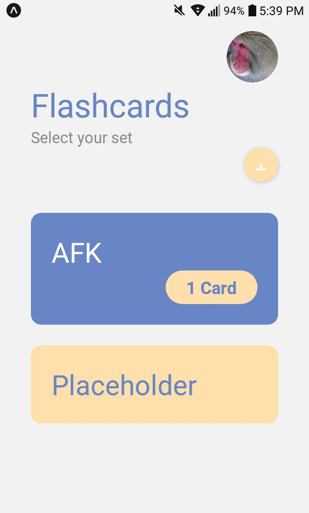
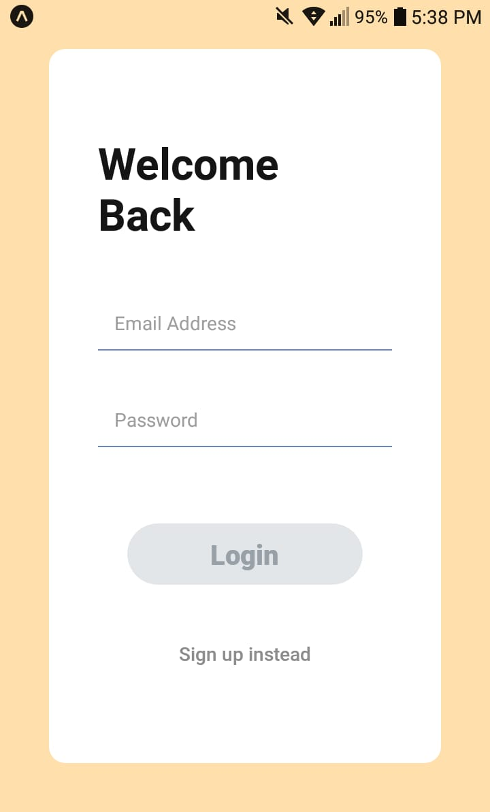

# Flashcard App



## Overview

The Flashcard App is a mobile application designed to assist users in learning and memorizing information through the use of digital flashcards. The app allows users to create, organize, and study flashcards across different categories.

## Features

- **Create and Manage Categories:** Users can organize their flashcards into different categories for better organization and focused study sessions.

- **Dynamic Flashcards:** Each flashcard consists of a front and back, allowing users to input questions and answers for effective learning.

- **User Authentication:** Secure user authentication ensures that each user's flashcards are private and accessible only to them.

- **Study Mode:** Engage in study sessions with a user-friendly interface that reveals the back of the flashcard upon interaction.

- **Randomized Flashcards:** The app provides a feature to randomize flashcards, aiding in a more comprehensive understanding of the content.

## Getting Started

### Prerequisites

- [Node.js](https://nodejs.org/) installed
- [Expo CLI](https://docs.expo.dev/get-started/installation/) installed

### Installation

1. Clone the repository:

   ```bash
   git clone https://github.com/JoseAngelAlbaJerez/FlashCard.git
   cd flashcard-app

2. Start the Expo development serve:
    ```bash
    expo start
    ```
3. Follow the Expo CLI instructions to run the app on an emulator or physical device.

# Technologies Used


### Made by: Jose Angel Alba 2022-0398
